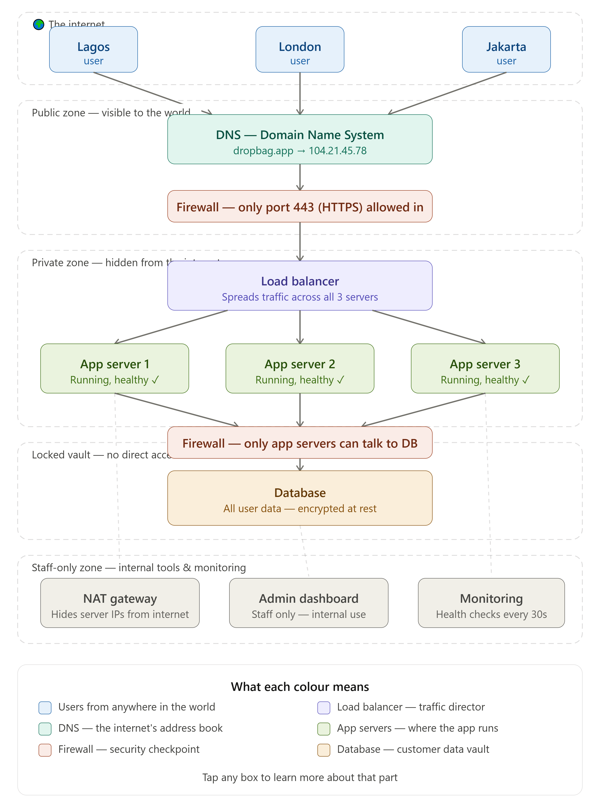

# Week 2 — Networking Fundamentals

## What I learned
- IP Addressing and CIDR
- DNS
- HTTP and HTTPS
- Firewalls
- NAT
- Load Balancing

## Project — DropBag Network Architecture
I designed the full network architecture for a startup called DropBag.

