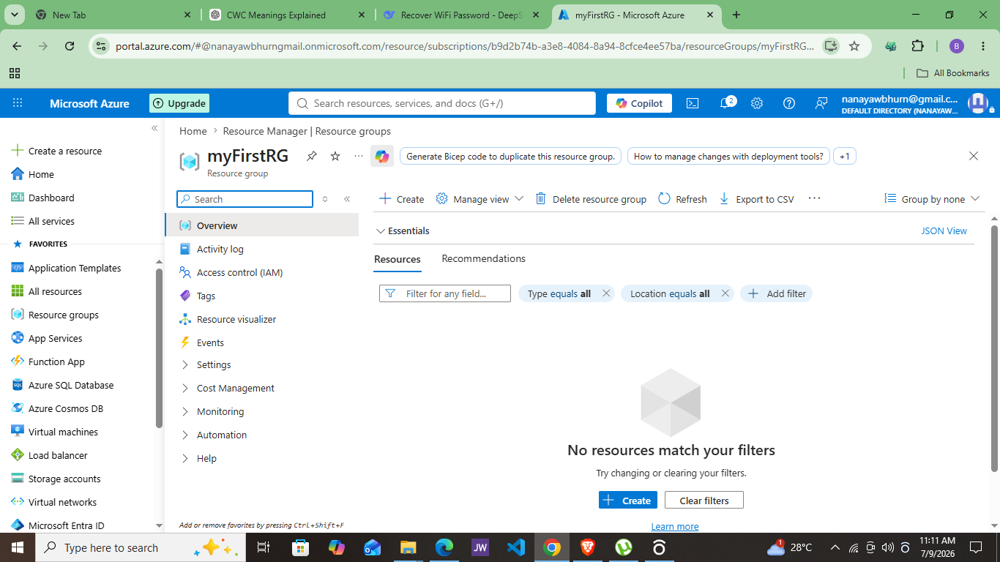
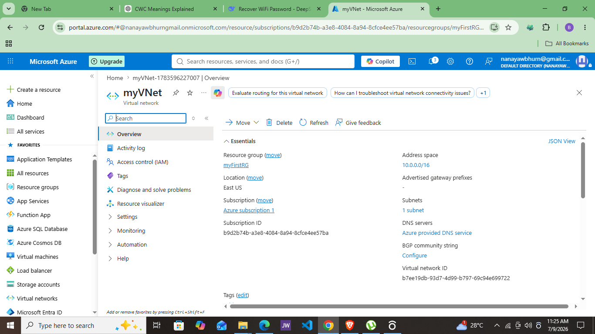
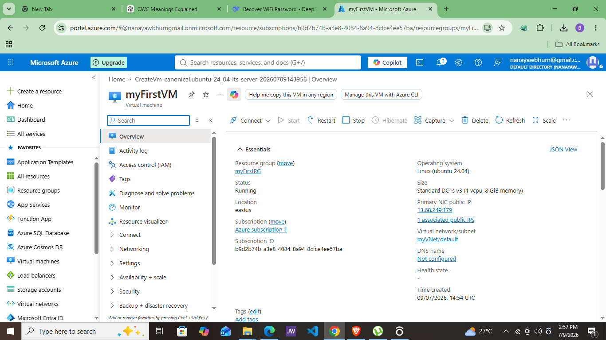
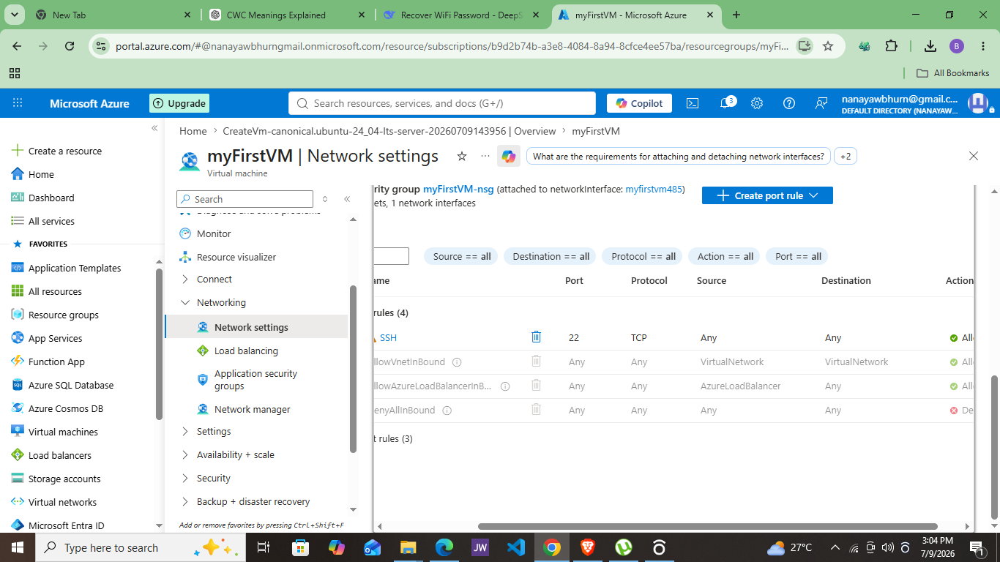

# Week 4 — Azure Fundamentals: Deploying My First Azure Infrastructure

## 1. Objective
This week I deployed a basic Azure environment from scratch — a resource group, a virtual network, and a virtual machine — and connected to it via SSH. The goal was to get real hands-on experience with Azure's core building blocks (compute, networking, security) rather than just reading about them, and to understand the shared responsibility model in practice.

## 2. Architecture Overview
Resource Group (myFirstRG)
└── Virtual Network (myVNet, 10.0.0.0/16)
└── Subnet (default, 10.0.0.0/24)
└── Virtual Machine (myFirstVM — Ubuntu 24.04 LTS)
├── Network Interface (NIC)
├── Public IP (myFirstVM-ip)
├── SSH Key (myFirstVM_key)
├── OS Disk
└── Network Security Group (myFirstVM-nsg — port 22 open)

text

## 3. Steps & Screenshots

### 3.1 Resource Group
Created a resource group to act as the container for every resource in this project.

- Name: `myFirstRG`
- Region: East US
- Subscription: Azure Subscription 1 (trial credit)



**What it does:** Acts as a logical folder — lets you manage, track, and delete every related resource as one unit instead of hunting them down individually.

---

### 3.2 Virtual Network
Created a VNet to give the VM its own private, isolated network space.

- Name: `myVNet`
- Address space: `10.0.0.0/16`
- Subnet: `default (10.0.0.0/24)`



I skipped the optional paid add-ons offered at this stage (Virtual Network Encryption, Azure Bastion, Azure Firewall, DDoS Protection) — none of these were needed for a basic learning deployment, but it was useful to see what each one does and where it fits in a real production security setup.

---

### 3.3 Virtual Machine
- Name: `myFirstVM`
- Image: Ubuntu Server 24.04 LTS
- Authentication: SSH public key (RSA), auto-generated key pair (`myFirstVM_key`)
- Username: `azureuser`
- Size: `Standard_DC1s_v3` (1 vCPU, 8 GiB memory)



**Sizing note:** I originally planned to use `Standard_B1s` (a small, low-cost "free-tier eligible" size), but it wasn't available under my subscription/region combination, and separately wasn't compatible with the "Trusted launch" security type Azure defaults new VMs to. After switching Security type to Standard and browsing "See all sizes," B-series still wasn't offered for my subscription in East US at all — so I selected the smallest available size without an availability error instead.

---

### 3.4 Networking Configuration
- Virtual network: `myVNet`
- Subnet: `default`
- Public IP: `myFirstVM-ip` (auto-created)
- NIC Network Security Group: Basic
- Inbound rule: **SSH (22)** — Allow selected ports



---

### 3.5 SSH Connection

```bash
ssh -i myFirstVM_key.pem azureuser@<public-ip>
Accepted the host fingerprint prompt on first connection, then landed on:

text
azureuser@myFirstVM:~$
Verified with:

bash
hostname   # myFirstVM
whoami     # azureuser
uname -a   # confirms Ubuntu/Linux kernel
https://./screenshots/05-ssh.png

3.6 Cleanup
Verified full teardown by checking All Resources with all filters cleared — confirmed zero resources remaining across the subscription after deleting myFirstRG.

bash
az group delete --name myFirstRG --yes --no-wait
https://./screenshots/06-cleanup.png

4. Concepts Learned
Regions vs Availability Zones: A region is a physical geographic location Azure operates in (e.g., East US). Availability Zones are physically separate datacenters within a region, each with independent power, cooling, and networking — used for high availability so that one zone failing doesn't take your whole app down.

Shared Responsibility Model: For an IaaS resource like a VM, Microsoft is responsible for the physical datacenter, host hardware, and virtualization layer — while I'm responsible for the OS, patching, network security rules (like which ports are open), and access control (SSH keys). This became very real during this project: Azure gave me the VM, but I had to decide and configure exactly which port (22) was exposed to the internet.

Portal vs CLI: Doing this through the Portal first made every underlying concept (resource groups, subnets, NSGs) visible and concrete. Later using Azure CLI in Cloud Shell (to fix a resource provider issue) showed how the same actions can be scripted and automated — much faster once you know what you're doing.

Resource Providers: Learned that Azure services (like networking) are backed by "resource providers" (e.g., Microsoft.Network) that must be registered on a subscription before certain resources — like Public IPs — can be created. New/trial subscriptions sometimes need this triggered manually.

5. Challenges & Troubleshooting
Issue	Cause	Fix
VM size Standard_B1s showed "NotAvailableForSubscription"	Trial subscription didn't have quota for that size in East US	Tried alternate sizes; also discovered B1s is incompatible with "Trusted launch" security type
B-series sizes missing entirely from "See all sizes" even after switching Security type to Standard	B-series simply wasn't offered for this subscription in this region	Selected the smallest available size with no error (Standard_DC1s_v3) instead of switching regions, to save time
Public IP field stuck on "Loading..." indefinitely during VM/networking setup	The Microsoft.Network resource provider wasn't registered on the subscription yet	Opened Azure Cloud Shell and ran az provider register --namespace Microsoft.Network, then confirmed with az provider show -n Microsoft.Network --query registrationState -o tsv until it returned Registered
Virtual network (myVNet) not appearing in the VM's Networking tab	Likely a temporary Portal refresh/caching issue (region and resource group both matched)	Waited and it resolved after registering the resource provider and refreshing
6. Cleanup
Resource group myFirstRG and all resources inside it (VM, VNet, NSG, NIC, Public IP, SSH key, OS Disk) were deleted successfully and confirmed via the "All Resources" view showing zero remaining resources.

7. Key Takeaways
Real deployments rarely go perfectly on the first try — quota limits, security-type compatibility, and resource provider registration are all things you only really learn by hitting them.

Next, I'd like to try recreating this same environment using Infrastructure as Code (Bicep or Terraform) to compare against doing it manually through the Portal.

Part of my Cloud Learning Journey — Week 4 of AWS + Azure fundamentals.
